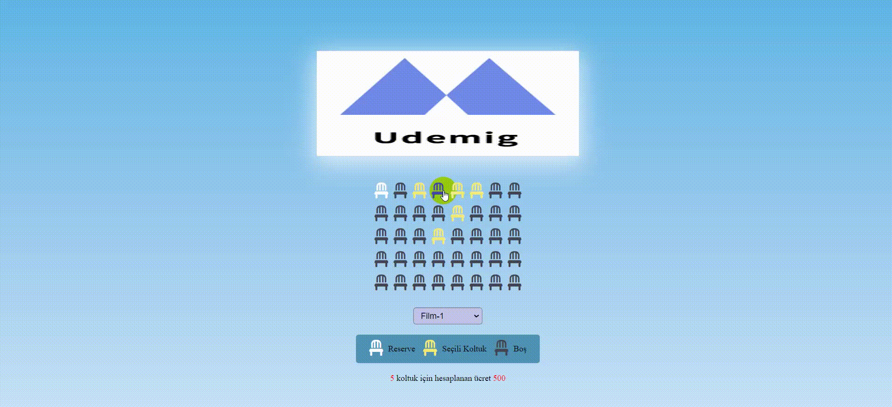

# Sinema Rezervasyon Projesi

Bu proje, kullanıcıların bir sinema salonunda film seçme, koltuk rezerve etme ve bilet satın alma işlemlerini gerçekleştirmelerini sağlayan basit bir web uygulamasını içerir. Projede HTML, CSS ve JavaScript kullanılmıştır.

## Kullanım
-Film Seçimi: Ana sayfada bulunan film seçiniz bölümünde birisine tıklayarak izlemek istediğiniz filmi seçin.

-Koltuk Seçimi: Seçtiğiniz film için uygun olan koltukları renk kodlarına göre seçin. Koltuklar rezerve edildikçe renkleri değişecektir.

-Bilet Satın Alma: Koltukları seçtikten sonra, ödeme bilgilerinizi girerek biletinizi satın alın.

Bilgi Ekranı: Seçtiğiniz koltukların toplam tutarı ve diğer bilgiler ekranda gösterilecektir.

## Proje Yapısı

- **index.html:** Ana sayfa ve kullanıcı arayüzü.
- **style.css:** Projenin stil dosyası.
- **script.js:** JavaScript kodlarının bulunduğu dosya.
-  Proje görselleri.




### Katkıda Bulunma
Eğer projeyi geliştirmek istiyorsanız, lütfen forklayın ve pull request gönderin. Yeni özellikler ve düzeltmeler her zaman hoş karşılanır.

### Lisans
Bu proje MIT Lisansı altında lisanslanmıştır.

## Nasıl Çalıştırılır

1. Projenin kopyasını bilgisayarınıza indirin veya repoyu klonlayın.

```bash
git clone https://github.com/kullanici/sinema-rezervasyon-projesi.git

cd sinema-rezervasyon-projesi
index.html dosyasını tarayıcınızda açın.


# Sinema-Rezervasyon
